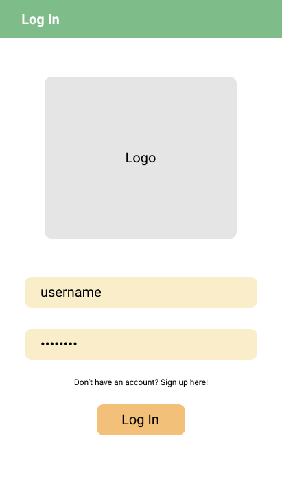
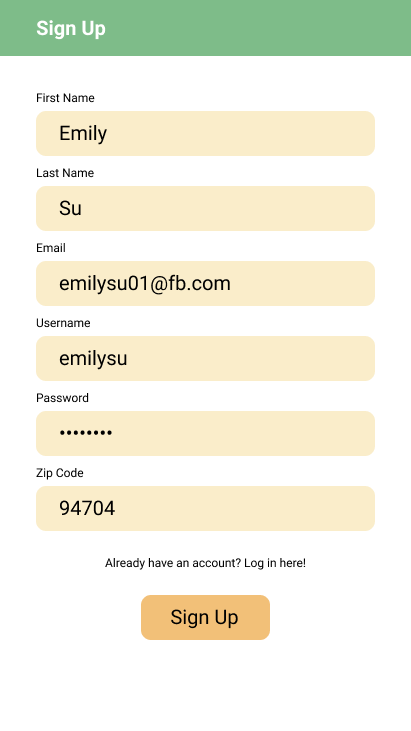
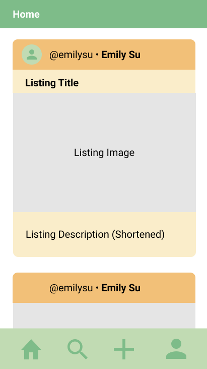
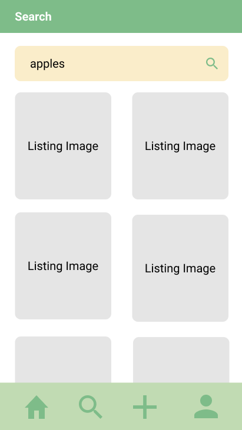
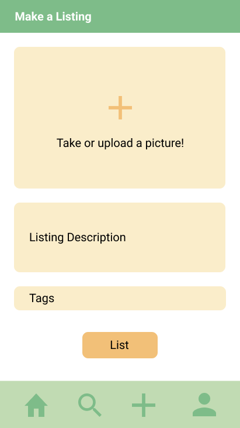
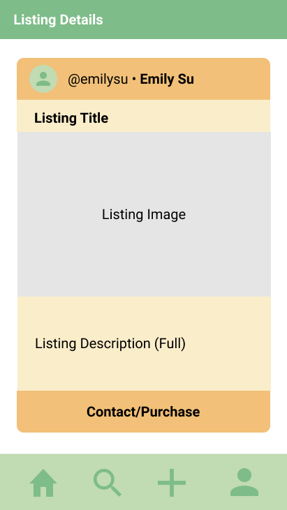
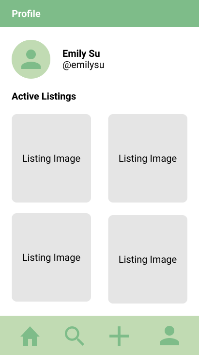

Original App Design Project - README Template
===

# Farmer's Market

## Table of Contents
1. [Overview](#Overview)
1. [Product Spec](#Product-Spec)
1. [Wireframes](#Wireframes)
2. [Schema](#Schema)

## Overview
### Description
Farmer’s Market (name TBD) is an Android app where users can access a marketplace to buy and sell overflow home-grown produce. 

### App Evaluation
[Evaluation of your app across the following attributes]
- **Category:** Marketplace App
- **Mobile:** 
  - Users can use the camera on their phone to take pictures of produce. 
  - Users can use the location services feature on their phone to check how close buyers/sellers are to them
- **Story:** 
  - Sellers: Often, produce is produced in overflow for one individual family to consume (e.g.: an orange tree produces between 100 and 300 oranges a year!). To reduce food waste and to make some extra money, users can sell their overflow produce to local community members.
  - Buyers: Users can buy fresh, home-grown produce (perhaps at a cheaper price) from local community members.
  - Both buyers and sellers receive environmental (less food waste, less transportation emissions, etc.), economic (extra money for sellers and cheaper produce for buyers), and social (meeting new community members, etc.) benefits from the app.
- **Market:**
  - Anyone could use the app. The app would be useful especially for users in warmer climates where produce is often grown in overflow. 
- **Habit:**
  - Users would be able to buy and sell produce on the app as frequently as they’d like. Users would likely use it every week or however often they purchase groceries.
- **Scope:**
  - See below for required and stretch user stories. The MVP version of the app can be completed within the next 5 weeks, with additional user stories implemented as time permits.

## Product Spec

### 1. User Stories (Required and Optional)

**Required Must-have Stories**

* Sign up feature
* Login feature
* Home feed with relevant listings
* Search for listings
* Make a listing
* Take pictures
  * Upload pictures
  * Maps feature
* Profile page with all of the user’s listings

**Optional Nice-to-have Stories**

* Messaging
* In-app payment
* Community events feature
* Reviews feature
* Following/followers feature
* Liking feature

### 2. Screen Archetypes

* Login screen
  * Login feature
* Sign up screen
  * Sign up feature
* Home screen
  * Home feed with relevant listings
* Search screen
  * Search for listings
* Listing screen
  * Take pictures
  * Upload pictures
* Maps feature
* Profile screen
  * Profile screen with all of the user’s listings
 

### 3. Navigation

**Tab Navigation** (Tab to Screen)

* Top menu bar
  * Log out
* Bottom navigation bar
  * Home
  * Search
  * List
  * Profile

**Flow Navigation** (Screen to Screen)

* Login screen
  * If user doesn’t have an account: sign up screen
  * If user logs in successfully: home screen
* Sign up screen
  * If user has an account: log in screen
  * If user signs up successfully: home screen
* Home screen
  * If user clicks on a listing: detailed listing screen
* Search screen
  * Search results screen
* Search results screen
  * If user clicks on a listing: detailed listing screen
* Make a listing screen
  * If user posts successfully: home screen
* Profile screen:
  * If user clicks on a listing: detailed listing screen
* Detailed listing screen:
  * If user clicks on the listing author: profile screen

## Digital Wireframes
Figma link[https://www.figma.com/file/GrzMC0LpIaBGpRodIDji3n/Emily-Su-FBU-App-Wireframes?node-id=10%3A146]

## Schema 
# Post
| Property        | Type                    | Description                                   | Required or Optional |
| -------------   | ----------------------- | --------------------------------------------- | -------------------  |
| objectId        | String                  | Unique ID for the listing (default field)     | Required             |
| createdAt       | DateTime                | Time when listing was created (default field) | Required             |
| author          | Pointer to User         | Author of the listing                         | Required             |
| images          | Array of Files          | Images associated with the listing            | Optional             |
| description     | String                  | Description of the listing                    | Required             |
| location        | ???                     | Location of listing                           | Required             |
| typeOfProduce   | String                  | Type of produce of the listing                | Required             |
| sellBy          | DateTime                | When the listing must be sold by              | Required             |

# User
| Property        | Type                    | Description                                  | Required or Optional |
| -------------   | ----------------------- | -------------------------------------------- | -------------------  |
| objectId        | String                  | Unique ID for the user (default field)       | Required             |
| username        | String                  | Username for the user                        | Required             |
| password        | String                  | Password for the user                        | Required             |
| email           | String                  | Email for the user                           | Required             |
| profilePic      | File                    | Profile picture for the user                 | Optional             |
| location        | ???                     | Location of the user                         | Required             |

### Models
[Add table of models]
### Networking
- [Add list of network requests by screen ]
- [Create basic snippets for each Parse network request]
- [OPTIONAL: List endpoints if using existing API such as Yelp]
